# Создание и настройка проекта

## Настройка Visual Studio <a href="#setting-up-visual-studio" id="setting-up-visual-studio"></a>

Запустите Visual Studio Installer.&#x20;

<figure>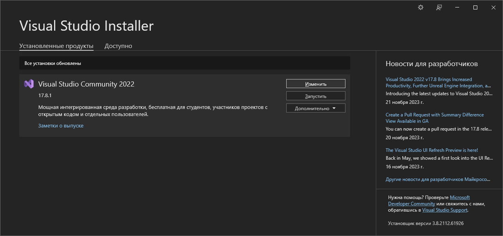<figcaption></figcaption></figure>

По кнопке "Изменить" откроется окно установки компонент среды разработки:

<figure><figcaption></figcaption></figure>

На вкладке "Рабочие нагрузки" поставьте галочку на компоненте **ASP.NET и разработка веб-приложений** и нажмите кнопку "Изменить".

## Создание проекта <a href="#create-new-project" id="create-new-project"></a>

В папке **\Template\Projects\1. Template** создадим папку **Objects**, в которой будут храниться исходники кастомных объектов для форм.

Запустим Visual Studio 2022.

На начальной странице выберем пункт **Create a new project** (Создать проект):

<figure>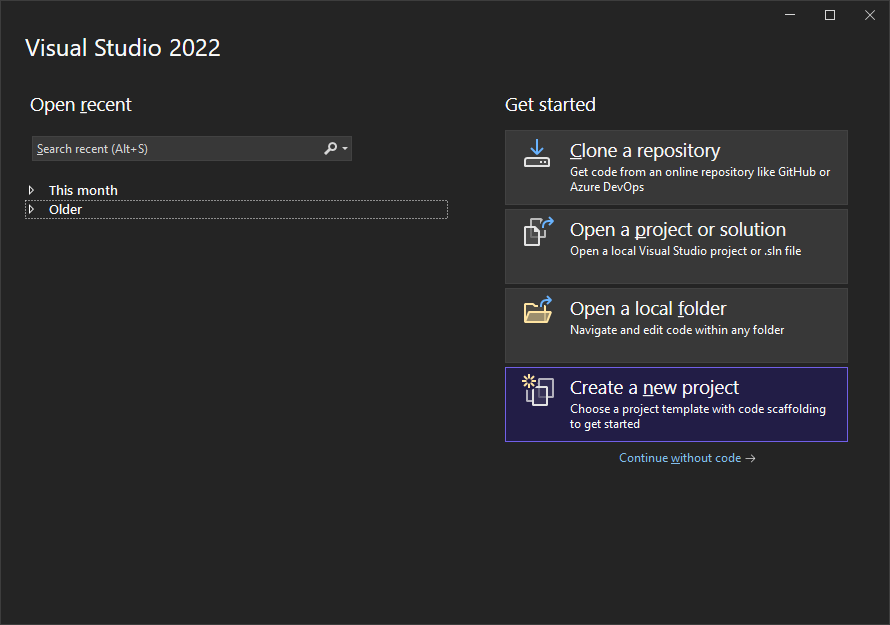<figcaption></figcaption></figure>

Если среда разработки Visual Studio уже открыта, то проект можно создать, выбрав пункт **File -> New -> Project...** в строке меню. А также нажав кнопку **New Project** на панели инструментов, или нажав комбинацию клавиш **Ctrl+Shift+N**.

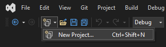

На странице **Create a new project** введите в поле поиска **library**.  Так как платформа написана на платформе **.NET Core**, то нам необходимо выбрать соответствующий тип приложения:

<figure><figcaption></figcaption></figure>


Если вы не видите шаблоны .NET, вероятно, у вас не установлена требуемая рабочая нагрузка. В сообщении **Not finding what you're looking for?** (Не удается найти то, что ищете?) выберите ссылку **Install more tools and features** (Установка других средств и компонентов). Откроется  Visual Studio Installer. Убедитесь, что у вас установлена рабочая нагрузка **ASP.NET и разработка веб-приложений**.


В диалоговом окне **Configure your new project** (Настройка нового проекта) доступны параметры, позволяющие присвоить имя проекту (и решению), выбрать расположение на диск&#x435;**:**

<figure><figcaption></figcaption></figure>

В поле **Project name** укажем имя нашего проекта - **Template**. В поле **Location** - ранее созданную папку Objects.

Галочку **Place solution and project in the same directory** можно снять.

В диалоговом окне **Additional information** (Дополнительные сведения) содержится параметр для выбора версии платформы:

<figure><figcaption></figcaption></figure>

Оставим здесь **.NET Core 3.1 (Out of support)** и нажмем на кнопку Create.

## Сборка проекта <a href="#building-project" id="building-project"></a>

Откроем свойства проекта, вызвав контекстное меню и выбрав пункт **Properties**. Или нажав комбинацию клавиш **Alt+Enter**.

<figure>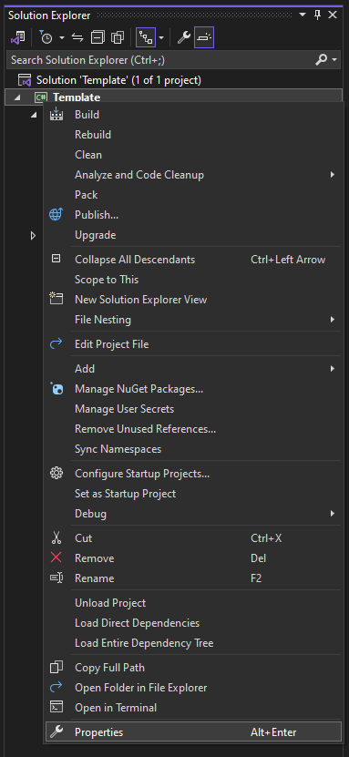<figcaption></figcaption></figure>

На вкладке **Build->Events** необходимо прописать команду, которая будет выполняться после сборки решения:

<figure>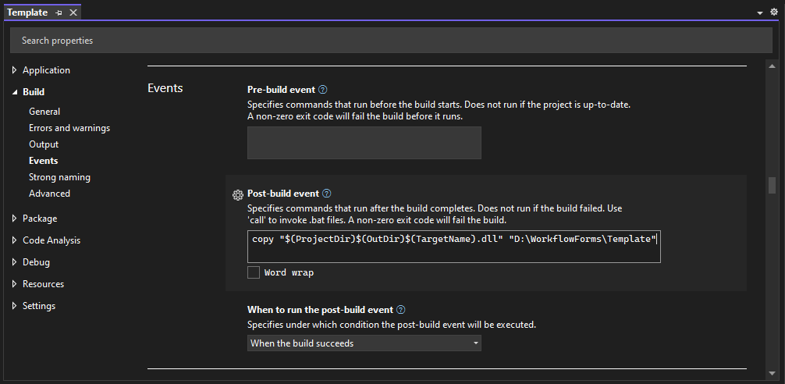<figcaption></figcaption></figure>

В поле **Post-build event** пропишем команду копирования собранного dll-файл из папки проекта в папку с  установленной клиентской частью:

```
copy "$(ProjectDir)$(OutDir)$(TargetName).dll" "D:\WorkflowForms\Template"
```

По умолчанию Visual Studio собирает проект в папку:

\Template\Projects\1. Template\Objects\Template\Template\bin\Debug\netcoreapp3.1

Давайте пересоберем проект, для этого в контекстном меню выберем пункт **Build** или **Rebuild**:

<figure>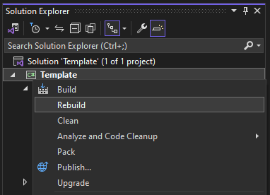<figcaption></figcaption></figure>

Проверьте, что файл Template.dll скопировался в папку с установленной клиентской частью.

## Отладка проекта <a href="#debug" id="debug"></a>

Чтобы запускать приложение напрямую из Visual Studio, сделаем настройки режима отладки. Для этого откроем свойства проекта и перейдем на вкладку **Debug**:

<figure>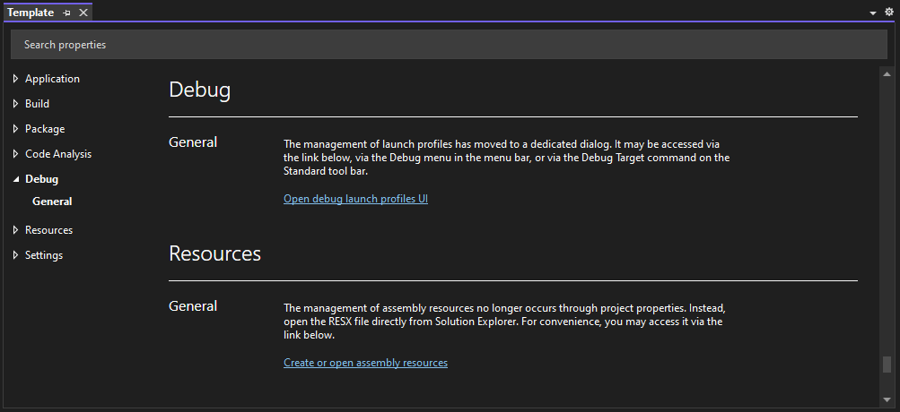<figcaption></figcaption></figure>

Кликнем по тексту **Open debug launch profiles UI**. В открывшемся окне профилей запуска кликнем по кнопке **Create a new profile**. В меню выберем пункт **Executable**:

<figure>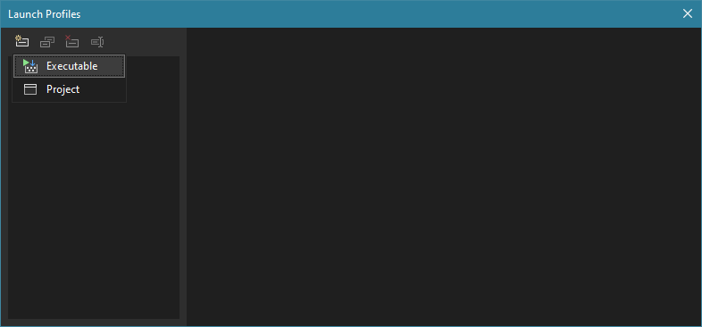<figcaption></figcaption></figure>

Новый профиль сразу переименуем, кликнув по кнопке **Rename selected profile**:

<figure>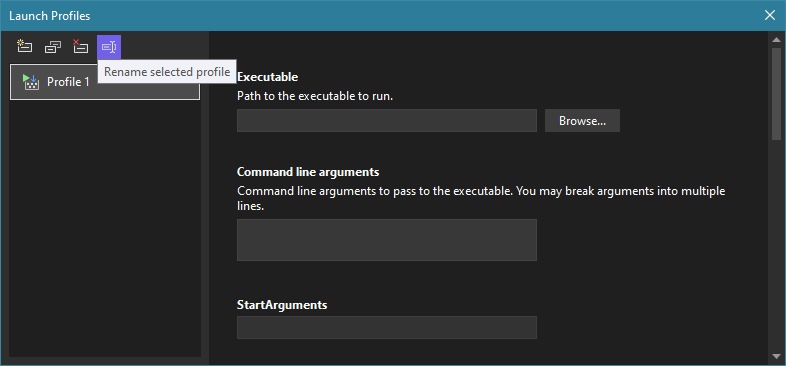<figcaption></figcaption></figure>

В поле **Executable** укажем путь до exe-файла приложения, размещенного в папке развернутой клиентской части:

<figure>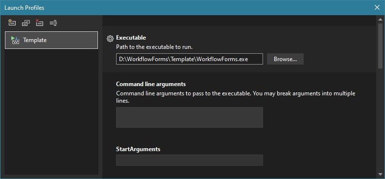<figcaption></figcaption></figure>

Теперь мы можем запустить приложение, нажав клавишу **F5** или кнопку на панели инструментов:

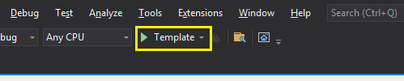

В проекте появился новый файл **launchSettings.json**, в котором будут храниться настройки профилей запуска приложения:

<figure>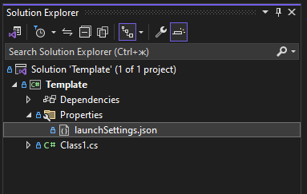<figcaption></figcaption></figure>
