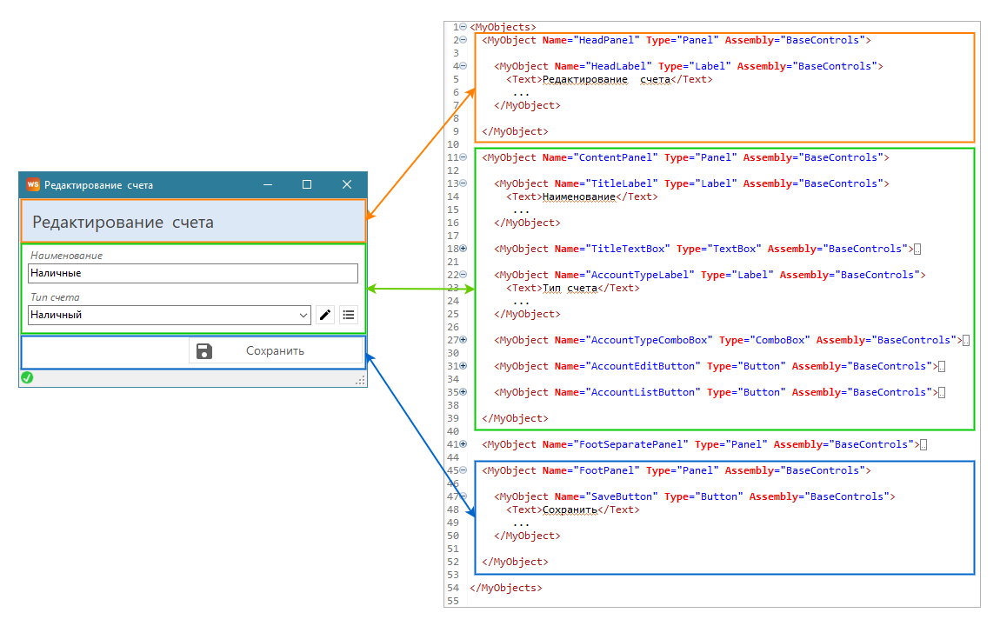

# Код

## Форматирование кода 

#### Workflow XML Editor

Для автоматического выравнивания кода в редакторе Workflow XML Editor используется сочетание клавиш **Ctrl + Q.**


Полный список сочетаний клавиш приведен в [статье](../workflow-xml-editor/keyboard-shortcuts.md).


## Серверная часть 

Элементы серверного xml-файла группируем в логические боки в рамках родительского тэга. И каждый блок отмечаем комментарием, раскрывающим смысл блока.

Например, запросы на получение списка городов и списка клиентов и запросы на редактирование этих списков объединяем в два блока:

<figure><figcaption></figcaption></figure>

В начале блока идут запросы на чтение данных о клиентах, а затем запросы на редактирование этих  данных.

В блок запросов для работы со списком можно добавить запрос на получение короткого списка, который будет использовать на формах в ComboBox - запрос ClientShortSelectSqlQuery. Если этот запрос будет вызываться только на одной форме, то лучше описать его в блоке запросов связанных с этой формой. Например, в блок запросов для работы с заказами добавлены запросы OrderPositionByOrderIdSelectSqlQuery и OrderPaymentByOrderIdSelectSqlQuery, которые будут вызываться только на форме заказа:

<figure><figcaption></figcaption></figure>

Аналогично группируем и AccessPoint, собирая в один блок точки доступа привязанные к одной сущности:

<figure><figcaption></figcaption></figure>

В случае с AccessPoint можно использовать короткую запись комментария для наименования блока, т.к. код занимает меньше места, чем описание SqlQuery с текстом запроса. Двустрочный комментарий удобен при редактировании кода SqlQuery с текстом запросов.

Описание Permission и Role так же группируем в блоки.

## Клиентская часть 

### Элементы формы 

Все элементы формы кроме ее объектов группируются в блоки, объединенные либо одной сущностью, либо одной логикой.

На скриншоте ниже видно, что в блоки "Позиции заказа" и "Оплаты" попали DataConnection, которые хранят списки сущностей для отображения в таблицах но форме. А в блок "Вспомогательные" попали те, что получают с сервера данные для выпадающих списков.

<figure><figcaption></figcaption></figure>

Аналогичным образом следует поступать с условиями и командами:

<figure><figcaption></figcaption></figure> <figure><figcaption></figcaption></figure>

### Объекты формы 

Порядок описания xml-кода элементов формы должен соответствовать порядку отображения элементов в интерфейсе. Объекты описываются сверху вниз и слева направо в пределах своего контейнера.

<figure><figcaption></figcaption></figure>

