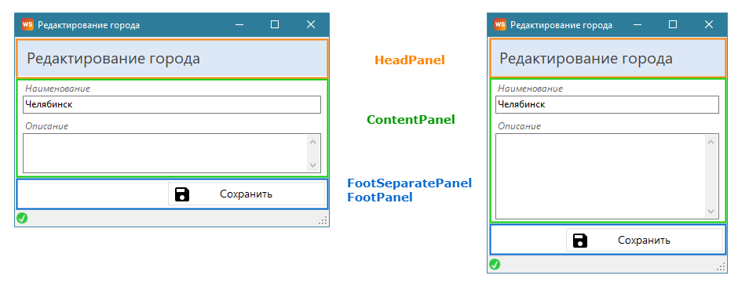

# Интерфейс

## Расположение объектов <a href="#location-of-objects" id="location-of-objects"></a>

Как правило, расположение графических объектов формы задается относительно друг друга через координаты Top и Left, в редких случаях используются координаты Bottom, Right.

Например, на форме:

<figure><figcaption></figcaption></figure>

Панель HeadPanel является самой первой и ее координаты Top и Left будут задаваться относительно самой формы:

```xml
<MyObject Name="HeadPanel" Type="Panel" Assembly="BaseControls">
  <Top>0</Top>
  <Left>0</Left>
  ...
</MyObject>
```

Координата Top всех нижележащих панелей будет привязываться к координате Bottom вышестоящей панели:

```xml
<MyObject Name="ContentPanel" Type="Panel" Assembly="BaseControls">
  <Top>
    <Object Name="HeadPanel">
      <Property Name="Bottom" />
    </Object>
  </Top>
  <Left>0</Left>
  ...
</MyObject>

<MyObject Name="FootSeparatePanel" Type="Panel" Assembly="BaseControls">
  <Top>
    <Object Name="ContentPanel">
      <Property Name="Bottom" />
    </Object>
  </Top>
  <Left>5</Left>
  ...
</MyObject>

<MyObject Name="FootPanel" Type="Panel" Assembly="BaseControls">
  <Top>
    <Object Name="FootSeparatePanel">
      <Property Name="Bottom" />
    </Object>
  </Top>
  <Left>0</Left>
  ...
</MyObject>
```

Координату Left для этих объектов задали константой относительно формы, но можно задать относительно координаты Left у HeadPanel .

Объекты внутри контейнера будут использовать аналогичную привязку друг к другу. Координаты Top, Left первого объекта задаются относительно контейнера:

```xml
<MyObject Name="TitleLabel" Type="Label" Assembly="BaseControls">
  <Top>5</Top>
  <Left>10</Left>
  ...
  <Text>Наименование</Text>
</MyObject>
```

А нижележащие объекты будут привязываться к вышестоящим:

```xml
<MyObject Name="TitleTextBox" Type="TextBox" Assembly="BaseControls">
  <Top>
    <Object Name="TitleLabel">
      <Property Name="Bottom" />
    </Object>
  </Top>
  <Left>
    <Object Name="TitleLabel">
      <Property Name="Left" />
    </Object>
  </Left>
  ...
</MyObject>
```

Если между объектами нужно задать расстояние, то следует использовать универсальные значения [Calculate](https://wfsys.gitbook.io/workflow-forms-syntax/workflow_forms/values/calculate) или [Formula](https://wfsys.gitbook.io/workflow-forms-syntax/workflow_forms/values/formula):

```xml
<MyObject Name="DescriptionLabel" Type="Label" Assembly="BaseControls">
  <Top>
    <Calculate>
      <Expression>{0} + 5</Expression>
      <Items>
        <Item>
          <Object Name="TitleTextBox">
            <Property Name="Bottom" />
          </Object>
        </Item>
      </Items>
    </Calculate>
  </Top>
  <Left>
    <Object Name="TitleTextBox">
      <Property Name="Left" />
    </Object>
  </Left>
  ...
  <Text>Описание</Text>
</MyObject>
```

Так как кнопка "Сохранить" выравнена по правому краю панели, то для задания ее положения используется координата Right:

```xml
<MyObject Name="SaveButton" Type="Button" Assembly="BaseControls">
  <Top>5</Top>
  <Right>
    <Formula>
      <Minus DataType="IntegerDataType">
        <Item>
          <Object Name="FootPanel">
            <Property Name="Width" />
          </Object>
        </Item>
        <Item>5</Item>
      </Minus>
    </Formula>
  </Right>
  ...
  <Text>Сохранить</Text>
</MyObject>
```

Привязка координат объектов к другим объектам позволяет с меньшим усилием вносить изменения в положение объектов при добавлении новых объектов или изменении их размеров - не нужно вручную вычислять константные значения для каждого объекта. А также это отлично работает, если пользователь может менять размеры окна формы.

## Динамические размеры формы <a href="#dynamic-form-size" id="dynamic-form-size"></a>

Тэг `<Form>` содержит атрибут [`FormBorderStyle`](https://wfsys.gitbook.io/workflow-forms-syntax/#form_border_style), который задает тип границ окна формы. Если атрибут имеет значение Sizable, то пользователь может изменять размер формы. Чтобы при изменении размеров формы элементы интерфейса могли корректировать свои размеры, свойства  Height и Width объектов должны описываться динамическими выражениями и привязываться к размерам контейнеров и самой формы.

Например, есть форма, которой можно менять размер:

<figure><figcaption></figcaption></figure>

Ширина всех панелей привязана к ширине формы:

```xml
<Width>
  <Form>
    <Property Name="Width" />
  </Form>
</Width>
```

А высота динамически будет меняться только у панели ContentPanel, для которой необходимо в тэге `<Height>` указать выражение вида:

```xml
<Height>
  <Calculate>
    <Expression>{0} - {1} - {2} - {3}</Expression>
    <Items>
      <Item>
        <Form>
          <Property Name="Height" />
        </Form>
      </Item>
      <Item>
        <Object Name="ContentPanel">
          <Property Name="Top" />
        </Object>
      </Item>
      <Item>
        <Object Name="FootSeparatePanel">
          <Property Name="Height" />
        </Object>
      </Item>
      <Item>
        <Object Name="FootPanel">
          <Property Name="Height" />
        </Object>
      </Item>
    </Items>
  </Calculate>
</Height>
```

Таким образом, высота ContentPanel будет напрямую зависеть от высоты формы и высоты объектов ниже панели. Учитывая координату Top самой панели, не нужно дополнительно следить за размерами объектов выше панели.

Если контейнер, размер которого изменяется, содержит элементы, размер которых тоже должен изменяться, то в тэги `<Height>` и `<Width>` этих объектов следует прописывать динамические выражения. Панель ContentPanel содержит текстового поля "Описание", которое является многострочным (признак [Multiline](https://wfsys.gitbook.io/workflow-forms-syntax/workflow_forms/objects/textbox#multiline)) и должно изменять свой размер. Для этого в тэг `<Height>` объекта DescriptionTextBox необходимо прописать выражение:

```xml
<Height>
  <Calculate>
    <Expression>{0} - {1} - 5</Expression>
    <Items>
      <Item>
        <Object Name="ContentPanel">
          <Property Name="Height" />
        </Object>
      </Item>
      <Item>
        <Object Name="DescriptionTextBox">
          <Property Name="Top" />
        </Object>
      </Item>
    </Items>
  </Calculate>
</Height>
```

Так же поля TitleTextBox и DescriptionTextBox изменяют и свою ширину. Это достигается тем, что в тэге `<Width>` прописывается выражение, учитывающее ширину контейнера:

```xml
<Width>
  <Calculate>
    <Expression>{0} - {1}*2</Expression>
    <Items>
      <Item>
        <Object Name="ContentPanel">
          <Property Name="Width" />
        </Object>
      </Item>
      <Item>
        <Object Name="TitleTextBox">
          <Property Name="Left" />
        </Object>
      </Item>
    </Items>
  </Calculate>
</Width>
```

Ширину объекта DescriptionTextBox  можно привязать к ширине объекта TitleTextBox:

```xml
<Width>
  <Object Name="DescriptionLabel">
    <Property Name="Width" />
  </Object>
</Width>
```

Координаты `<Top>`/`<Bottom>`, `<Left>`/`<Right>`, `<Height>` и `<Width>` принимают целочисленные значения, поэтому если выражение задающее их значение содержит операцию деления, то необходимо использовать функцию округления.

Например, ширина объекта TitleTextBox должна составлять половину ширины контейнера с учетом отступа слева и справа:

```xml
<Width>
  <Calculate>
    <Expression>Ceiling(({0} - {1}*2)/2)</Expression>
    <Items>
      <Item>
        <Object Name="ContentPanel">
          <Property Name="Width" />
        </Object>
      </Item>
      <Item>
        <Object Name="TitleTextBox">
          <Property Name="Left" />
        </Object>
      </Item>
    </Items>
  </Calculate>
</Width>
```


Для округления используются следующие методы:

* `Floor(value)` - округляет вниз по направлению к отрицательной бесконечности;
* `Ceiling(value)` - округляет вверх по направлению к положительной бесконечности;
* `Truncate(value)` - округляет вниз или вверх по направлению к нулю;
* `Round(value, digits)` - округляет к ближайшему числу с заданным количеством знаков после запятой.


## Подсказки на элементах <a href="#hints-on-elements" id="hints-on-elements"></a>

Элементы, назначение которых неочевидно или их текст неполностью передает его, то такие элементы должны сопровождаться всплывающими подсказками.

Например, кнопки могут иметь два варианта отображения: иконка с текстом и только иконка. Если кнопка имеет только иконку, то такая кнопка должна иметь подсказку определенную в тэге `<Hint>`.

Состояние кнопки может изменяться динамически, при этом подсказка все равно должна быть:

<figure><figcaption></figcaption></figure>

Подсказки могут быть и на других объектах, например, на Panel, чтобы пояснить логику полей, описанных в панели:

<figure><figcaption></figcaption></figure>

Главное, показать пользователю, что при наведении курсора мыши в конкретное место, он получит подсказку. На скриншоте выше о наличии подсказки говорит иконка со знаком ворпроса.

К подсказкам на элементах относится и подсказка при срабатывании конструкции [`<Checking>`](https://wfsys.gitbook.io/workflow-forms-syntax/workflow_forms/checkings):

<figure><figcaption></figcaption></figure>

Такие подсказки могут не только говорить, что поле обязательно для заполнение, но и говорить, как правильно его заполнить.

## Обязательные поля <a href="#required-fields" id="required-fields"></a>

Если на форме есть поля, обязательные для заполнения, или поля чувствительные к правильности заполнения, то для них следует использовать конструкцию [`<Checking>`](https://wfsys.gitbook.io/workflow-forms-syntax/workflow_forms/checkings).

```xml
<Checking>
  <Object Name="TitleTextBox" />
  <ConditionExpression>
    <Condition Name="TitleIsNullOrEmptyCondition" />
  </ConditionExpression>
  <AsteriskHint>Пожалуйста, заполните это поле</AsteriskHint>
</Checking>
```

В тэге `<ConditionExpression>` проверяется условие корректного заполнения поля, если условие не выполняется, то возле поля будет отображаться полоска, при наведении на которую будет отображаться текст подсказки из тэга `<AsteriskHint>`.

<figure><figcaption></figcaption></figure>

Чтобы сохранение было недоступно, если обязательные поля не заполнены, необходимо создать условие для проверки срабатывания конструкций `<Checking>`:

```xml
<Condition Name="MandatoryFieldsAreFilledEqualCondition" Type="NestedCondition" Assembly="Conditions">
  <ConditionExpression>
    <Not>
      <Form>
        <Property Name="CheckingFired"/>
      </Form>
    </Not>
  </ConditionExpression>
</Condition>
```

Свойства [CheckingFired](https://wfsys.gitbook.io/workflow-forms-syntax/#get_checking_fired) у формы вернет True, если сработал хоть один `<Checking>`. Таким образом, проверка этого свойства избавляет от необходимости повторно описывать все условия корректности обязательных полей.

Дальше это условие можно использовать в `<Execution>` или на кнопке "Сохранить".

Размер и цвет полоски задается в атрибутах [`FlatColor`](https://wfsys.gitbook.io/workflow-forms-syntax/#flat_color) и [`FlatWidth`](https://wfsys.gitbook.io/workflow-forms-syntax/#flat_width) описанных в тэге `<Form>`. В атрибуте [`ValidationType`](https://wfsys.gitbook.io/workflow-forms-syntax/#validation_type) задается вид отображения `<Checking>` формы:

* Flat - Полоска слева от объекта;
* Asterisk - "Звёздочка" справа от объекта

Если выбран вид _Asterisk_, то для настроек цвета используется атрибут [`AsteriskForeColor`](https://wfsys.gitbook.io/workflow-forms-syntax/#asterisk_fore_color), а для задания размера используется размер шрифта, указанного в атрибуте [`AsteriskFontStyle`](https://wfsys.gitbook.io/workflow-forms-syntax/#asterisk_font_style).

<figure><figcaption></figcaption></figure>

### Группы обязательных полей <a href="#groups-of-required-fields" id="groups-of-required-fields"></a>

Бывают случае, когда необходимо разделить логику обязательных полей на разные события. Например, есть форма заказа с кнопками "Сохранить" и "Печать". Часть полей будут основными и обязательными для заполнения и при сохранении заказа, и при печати бланка заказа. К таким полям можно отнести данные о клиенте, дата и номер заказа. А какие-то поля будут обязательными только для печати - позиции заказа. Если пользователь сохраняет изменения на форме, то проверка корректности заполнения должна проходить только для полей обязательных при сохранении.&#x20;

Чтобы реализовать такое разделение обязательных полей, конструкция `<Checking>` имеет вложенный тэг [\<Group>](https://wfsys.gitbook.io/workflow-forms-syntax/workflow_forms/checkings#group), который задает имя группы:

```xml
<Checking>
  <Object Name="ClientComboBox" />
  <Group Name="Saving" />
  <ConditionExpression>
    <Condition Name="ClientComboBoxIsNullOrEmptyCondition" />
  </ConditionExpression>
  <AsteriskHint>Пожалуйста, заполните это поле</AsteriskHint>
</Checking>

<Checking>
  <Object Name="OrderPositionDatabaseTable" />
  <Group Name="Printing" />
  <ConditionExpression>
    <And>
      <Condition Name="OrderPositionDatabaseTableIsEmptyEqualCondition" />
      <Object Name="ShowAsteriskHintVariable" />
    </And>
  </ConditionExpression>
  <AsteriskHint>Пожалуйста, заполните таблицу</AsteriskHint>
</Checking>
```

Где ShowAsteriskHintVariable - обычный Variable со значением False по умолчанию:

```xml
<MyObject Name="ShowAsteriskHintVariable" Type="Variable" Assembly="SimpleControls" ChangeForm="False">
  <Value>False</Value>
</MyObject>
```

Это вспомогательная переменная, которая позволяет ограничить срабатывание проверки обязательных полей. При нажатии на кнопку "Печать" должна вызываться команда вида, которая будет запускать проверку полей обязательных для печати:

```xml
<Command Name="ShowAsteriskHintValueSetCommand" Type="ValueSetCommand" Assembly="Commands">
  <Object Name="ShowAsteriskHintVariable">True</Object>
</Command>
```

Чтобы ограничить выполнения команд на сохранение или печати, необходимо создать условия проверки срабатывания `<Checking>` в конкретной группе:

```xml
<Condition Name="MandatoryFieldsAllowedSavingNestedCondition" Type="NestedCondition" Assembly="Conditions">
  <ConditionExpression>
    <Not>
      <Form>
        <Property Name="CheckingFired">Saving</Property>
      </Form>
    </Not>
  </ConditionExpression>
</Condition>

<Condition Name="MandatoryFieldsAllowedPrintingNestedCondition" Type="NestedCondition" Assembly="Conditions">
  <ConditionExpression>
    <Not>
      <Form>
        <Property Name="CheckingFired">Printing</Property>
      </Form>
    </Not>
  </ConditionExpression>
</Condition>
```

## Активные кнопки <a href="#active-buttons" id="active-buttons"></a>

Когда у объекта типа [Button](https://wfsys.gitbook.io/workflow-forms-syntax/workflow_forms/objects/button) условие в тэге `<Enabled>` имеет значение False, визуально кнопка становиться недоступной, и пользователь не понимает из-за чего. Поэтому кнопки всегда должны быть активны, а если условие не выполняется, то при нажатии на кнопку пользователь должен получать сообщение о том, что пошло не так и как это исправить.

Для быстрой и простой реализации такой функциональности у кнопки Button есть режим [DisabledMode](https://wfsys.gitbook.io/workflow-forms-syntax/workflow_forms/objects/button#disabled_mode), который включается через тэг `<DisabledMode>`. Кнопка всегда остается активной, даже если Enabled равен False, а при нажатии на "неактивную" кнопку форма будет показывать сообщение с текстом из тэга `<DisabledText>`.

Например, кнопка для открытия формы на редактирование сущности, которая будет доступна, если выбрана запись в таблице [DatabaseTable](https://wfsys.gitbook.io/workflow-forms-syntax/workflow_forms/objects/databasetable):

```xml
<MyObject Name="ItemEditButton" Type="Button" Assembly="BaseControls">
  ...
  <Enabled>
    <Condition Name="ItemSelectedCondition" />
  </Enabled>
  <DisabledMode>True</DisabledMode>
  <DisabledText>Выберите запись для редактирования.</DisabledText>
</MyObject>
```

В некоторых случаях включать режим DisabledMode можно динамически. Например, для кнопки "Сохранить" в карточке сущности. Если пользователь открыл карточку сущности и еще не внес изменения, то кнопка "Сохранить" может быть неактивной. В этом случае режим DisabledMode может быть выключен. Но, как только пользователь изменит хоть одно поле на форме, режим DisabledMode следует включить и проверять корректность и полноту заполнения обязательных полей.

```xml
<MyObject Name="SaveButton" Type="Button" Assembly="BaseControls">
  ...
  <Enabled>
    <And>
      <Condition Name="FormChangedEqualCondition" />
      <Condition Name="MandatoryFieldsAreFilledEqualCondition" />
    </And>
  </Enabled>
  <DisabledMode>
    <Condition Name="FormChangedEqualCondition" />
  </DisabledMode>
  <DisabledText>Одно или несколько полей заполнены некорректно.</DisabledText>
</MyObject>
```

Условие FormChangedEqualCondition проверяет свойство [FormChanged](https://wfsys.gitbook.io/workflow-forms-syntax/#get_form_changed) у формы, а условие MandatoryFieldsAreFilledEqualCondition - свойство [CheckingFired](https://wfsys.gitbook.io/workflow-forms-syntax/#get_checking_fired) у формы.
