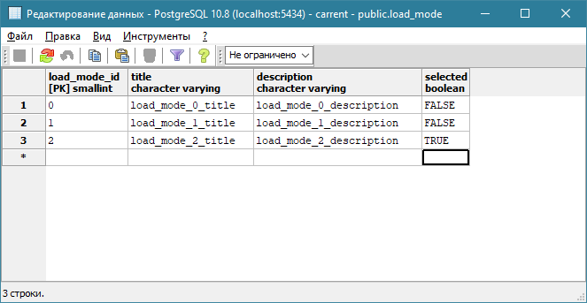

# Загрузка данных

## Режим загрузки данных (LoadMode) <a href="#load_mode" id="load_mode"></a>

Платформа Workflow Technology поддерживает три режима загрузки данных:

<table data-header-hidden><thead><tr><th width="293.54691242202404"></th><th width="423.16086896908183"></th></tr></thead><tbody><tr><td><a href="data-loading.md#mode-0-sequential">Режим 0 - последовательный</a></td><td>Обеспечивает минимальную скорость загрузки форм, при этом требует минимальное количество ресурсов со стороны сервера.</td></tr><tr><td><a href="data-loading.md#mode-1-packet">Режим 1 - пакетный</a></td><td>Обеспечивает стандартную скорость загрузки форм, при этом не требует значительного количества ресурсов со стороны сервера.</td></tr><tr><td><a href="data-loading.md#mode-2-parallel">Режим 2 - параллельный</a></td><td>Обеспечивает увеличенную скорость загрузки форм, однако при этом требует максимальное количество ресурсов со стороны сервера. <br><br>Режим по умолчанию.</td></tr></tbody></table>


Режимы загрузки работают только _в момент открытия формы и первичной загрузки_ данных в PrimaryGetDataConnection, не имеющих тэга [`<ManualLoad>`](https://wfsys.gitbook.io/workflow-forms-syntax/workflow_forms/dataconnections/primary_dc#manual_load) со значением True.

Режимы загрузки данных не влияют на работу команды [DataConnectionRefreshCommand](https://wfsys.gitbook.io/workflow-forms-syntax/workflow_forms/commands/dc_refresh_command).


Эти режимы описаны в таблице **public.load\_mode**:

<figure><figcaption></figcaption></figure>

В поле **selected** указывается текущий режим.

Платформа при загрузке формы строит дерево зависимостей для запросов в DataConnection (в одном DataConnection может быть несколько запросов). При этом учитываются все связи между ними (прямые и косвенные через команды и объекты). На основе этого дерева строится порядок выполнения запросов. Первыми всегда будут выполняться те запросы, которые не зависят от результата выполнения других запросов.


Далее на примере карточки заказа рассмотрим работу каждого режима.

Форма содержит соединения с данными:

<figure><figcaption></figcaption></figure>

Все PrimaryGetDataConnection не зависят друг от друга, кроме ClientPrimaryGetDataConnection, которое в параметре ClientId получает значение из поля ClientId соединения OrderPrimaryGetDataConnection.


Каждый раз меняя режим загрузки данных на форме настроек, не забывайте _перезапускать клиентскую часть_, чтобы применились настройки.


### Режим 0 - последовательный <a href="#mode-0-sequential" id="mode-0-sequential"></a>

В последовательном режиме все запросы будут выполняться друг за другом в порядке описания PrimaryGetDataConnection в xml-файле. Отправив один запрос, форма будет дожидаться ответа от сервера и затем отправлять следующий запрос.

.png>)

На диаграмме видно, что ClientPrimaryGetDataConnection, зависящий от поля ClientId соединения OrderPrimaryGetDataConnection, загрузился последним. А остальные загрузились в порядке описания в файле.

Узким местом такого режима будет наличие _тяжелого запроса_, который будет тормозить загрузку формы, хотя в момент его выполнения сервер может параллельно обрабатывать другие запросы, которые не зависят от его результатов.

Например, если соединение OrderPrimaryGetDataConnection будет использовать тяжелый запрос, то порядок загрузки данных будет иметь вид:

.png>)

В такой ситуации ждать результата OrderPrimaryGetDataConnection необходимо только для ClientPrimaryGetDataConnection, так как он зависит от значения в поле ClientId. А остальные DataConnection можно запустить параллельно, чтобы не терять время в пустом ожидании.

### Режим 1 - пакетный <a href="#mode-1-packet" id="mode-1-packet"></a>

В пакетном режиме после построения дерева зависимостей запросы разбиваются на пакеты. В первый пакет попадают все запросы, которые ни от кого не зависят,  во второй пакеты - запросы, которые зависят от запросов из предыдущего пакета, и так далее.

.png>)

На диаграмме видим, что в первый пакет попало шесть запросов. Запрос ClientShortSelectSqlQuery отправился на сервер во втором пакете после того, как выполнился самый тяжелый запрос OrderByIdSelectSqlQuery первого пакета.

Зависимостью можно управлять через тэг [`<DependOn>`](https://wfsys.gitbook.io/workflow-forms-syntax/workflow_forms/dataconnections/primary_dc#depend_on), указав в нем список DataConnection, которые должны быть выполнены раньше текущего.

Например, для OrderPositionPrimaryGetDataConnection и OrderPaymentPrimaryGetDataConnection будет указана зависимость от OrderPrimaryGetDataConnection. В таком случае диаграмма будет иметь вид:

.png>)

В первом пакете осталось четыре запроса, а во второй пакет к ClientShortSelectSqlQuery попали OrderPositionByOrderIdSelectSqlQuery и OrderPaymentByOrderIdSelectSqlQuery.

На диаграмме включили новые объекты OnSuccess, чтобы видеть моменты, когда форма получила результаты от сервера. В нашем случае ответы о выполнении всех запросов первого пакета пришли по завершении самого тяжелого запроса.

Таким образом, узким местом этого режима так же является наличие тяжелого запроса, который будет тормозить отправку следующего пакета.

### Режим 2 - параллельный <a href="#mode-2-parallel" id="mode-2-parallel"></a>

В этом режиме так же строится дерево зависимостей, после чего формируется первая волна независимых запросов, которые параллельно отправляются на сервер. Следующие запросы не будут ждать выполнения всех запросов из первой волны, а будут отправляться на сервер по мере того, как будут готовы результаты всех запросов, от которых они зависят.

Например, для OrderPositionPrimaryGetDataConnection будет указана зависимость на MaterialPrimaryGetDataConnection. А запрос MaterialSimpleSelectSqlQuery будет являться тяжелым.&#x20;

В этом случае картина загрузки данных будет следующей:

.png>)

После того как на сервер ушли все запросы первой волны, ClientPrimaryGetDataConnection не стал дожидаться завершения MaterialPrimaryGetDataConnection, а сразу же ушел на сервер, как только был готов результат OrderPrimaryGetDataConnection. В то время как OrderPositionPrimaryGetDataConnection дожидался завершения запроса, от которого зависит и отправился в третьей волне.

## Ручное управление загрузкой данных <a href="#manual-data-loading-control" id="manual-data-loading-control"></a>

Есть две возможности, которые позволяют разработчику контролировать порядок загрузки данных при старте формы помимо выбора режима LoadMode:

* тэг [`<DependOn>`](https://wfsys.gitbook.io/workflow-forms-syntax/workflow_forms/dataconnections/primary_dc#depend_on), позволяющий задать список зависимостей;
* тэг [`<ManualLoad>`](https://wfsys.gitbook.io/workflow-forms-syntax/workflow_forms/dataconnections/primary_dc#manual_load), выключающий соединение из автоматической загрузки данных при старте формы.

### DependOn <a href="#dependon" id="dependon"></a>

Управление зависимостью через тэг [`<DependOn>`](https://wfsys.gitbook.io/workflow-forms-syntax/workflow_forms/dataconnections/primary_dc#depend_on) в описании PrimaryGetDataConnection - так мы можем контролировать построение дерева зависимостей в момент загрузки формы.

```xml
<DataConnection Name="1PrimaryGetDataConnection" Type="PrimaryGetDataConnection" Assembly="DataConnections">
  <DependOn>
    <DataConnection Name="2PrimaryGetDataConnection"/>
  </DependOn>
  <SqlQuery Name="1SelectSqlQuery" Type="Select">
    <Workflow Name="Template" />
    <Fields>
      <Field Name="1Field" />
      <Field Name="2Field" />
    </Fields>
  </SqlQuery>
</DataConnection>

<DataConnection Name="2PrimaryGetDataConnection" Type="PrimaryGetDataConnection" Assembly="DataConnections">
  <SqlQuery Name="2SelectSqlQuery" Type="Select">
    <Workflow Name="Template" />
    <Fields>
      <Field Name="1Field" />
      <Field Name="2Field" />
    </Fields>
  </SqlQuery>
</DataConnection>
```

### ManualLoad <a href="#manual_load" id="manual_load"></a>

Можно перевести все PrimaryGetDataConnection в режим ручной загрузки, добавив вложенный тэг [`<ManualLoad>`](https://wfsys.gitbook.io/workflow-forms-syntax/workflow_forms/dataconnections/primary_dc#manual_load) со значением True. DataConnection с ручной загрузкой не будет выполняться в момент загрузки формы. Для его обновления при старте формы необходимо вызвать команду [DataConnectionRefreshCommand](https://wfsys.gitbook.io/workflow-forms-syntax/workflow_forms/commands/dc_refresh_command) в [Execution](https://wfsys.gitbook.io/workflow-forms-syntax/workflow_forms/executions) по условию [FormLoadedCondition](https://wfsys.gitbook.io/workflow-forms-syntax/workflow_forms/conditions/event_condition/form_loaded_condition).

## DataConnectionRefreshCommand <a href="#data_connection_refresh_command" id="data_connection_refresh_command"></a>

В команде DataConnectionRefreshCommand все DataConnection можем разбивать на пакеты, используя атрибуты `Packet` (разрешает загрузку DC в пакете) и `PacketGroup` (текстовая метка пакета):

```xml
<Command Name="AllDataConnectionRefreshCommand" Type="DataConnectionRefreshCommand" Assembly="Commands">
  <DataConnections>
    <!-- Первый пакет -->
    <DataConnection Name="1PrimaryGetDataConnection" Packet="True" PacketGroup="0"/>
    <DataConnection Name="2PrimaryGetDataConnection" Packet="True" PacketGroup="0"/>
    <!-- Второй пакет -->
    <DataConnection Name="3PrimaryGetDataConnection" Packet="True" PacketGroup="1"/>
    <DataConnection Name="4PrimaryGetDataConnection" Packet="True" PacketGroup="1"/>
  </DataConnections>
</Command>
```

При разбиении DataConnection на пакеты в команде типа DataConnectionRefreshCommand необходимо придерживаться следующих правил:

* Имена пакетов, указанные в атрибуте `PacketGroup`, являются текстовой меткой пакета и _не определяют порядок_ выполнения пакетов. Порядок выполнения пакетов задается порядком упоминания метки пакета в команде;
* DataConnection из одного пакета лучше описывать друг за другом, чтобы не создавать путаницы;
* В первый, в порядке объявления, пакет следует указывать запросы, которые _не зависят_ от других запросов;
* В следующий, в порядке объявления, пакет должны попадать запросы, которые _зависят от запросов из предыдущего_ пакета;
* Если в команде не указано явное разбиение на пакеты, то считается, что все запросы находятся в одном пакете.

В качестве эксперимента на форме карточки заказа переведем все PrimaryGetDataConnection в режим ручной загрузки (ManualLoad = True) и создадим команду, в которой все DataConnection разобьем на четыре пакета:

```xml
<Command Name="AllDataConnectionRefreshCommand" Type="DataConnectionRefreshCommand" Assembly="Commands">
  <DataConnections>
    <!-- Пакет 0 -->
    <DataConnection Name="SettingsPrimaryGetDataConnection" Packet="True" PacketGroup="0" />
    <DataConnection Name="AccountPrimaryGetDataConnection" Packet="True" PacketGroup="0" />
    <DataConnection Name="MaterialPrimaryGetDataConnection" Packet="True" PacketGroup="0" />

    <!-- Пакет 1 -->
    <DataConnection Name="OrderPrimaryGetDataConnection" Packet="True" PacketGroup="1" />

    <!-- Пакет 2 -->
    <DataConnection Name="OrderPositionPrimaryGetDataConnection" Packet="True" PacketGroup="2" />
    <DataConnection Name="OrderPaymentPrimaryGetDataConnection" Packet="True" PacketGroup="2" />

    <!-- Пакет 3 -->
    <DataConnection Name="ClientPrimaryGetDataConnection" Packet="True" PacketGroup="3" />
  </DataConnections>
</Command>
```

При загрузке формы увидим примерную диаграмму:

<figure><figcaption></figcaption></figure>

Здесь можем наблюдать повторное обновление **ClientPrimaryGetDataConnection**. Первое обновление произошло автоматически из-за изменения параметра ClientId, которое было вызвано обновлением **OrderPrimaryGetDataConnection**.

Чтобы избежать автоматического обновления данных при изменении значения параметра, следует использовать атрибут `RefreshQuery` со значением False.

Давайте добавим такой атрибут для параметра ClientId в ClientPrimaryGetDataConnection и проверим диаграмму загрузки:

<figure><figcaption></figcaption></figure>

Теперь данные загружаются в том порядке, который необходим нам, и без лишних обновлений.

### Параллельное выполнение запросов <a href="#parallel-query-execution" id="parallel-query-execution"></a>

По умолчанию команда DataConnectionRefreshCommand отправляет все загружающие соединения с данными в рамках одного PacketGroup на сервер одним запросом. Форма дожидается результата обновления всех запросов из пакета и после этого рассылает событие своим объектам для обновления значений.

<figure><figcaption></figcaption></figure>

Зачастую возникает необходимость обновлять данные на форме не дожидаясь результатов долгого запроса. Это обеспечивает плавную отрисовку формы и дает пользователю возможность начать работать на форме.

Для таких случаев команда DataConnectionRefreshCommand имеет вложенный тэг [`<Parallel>`](https://wfsys.gitbook.io/workflow-forms-syntax/workflow_forms/commands/dc_refresh_command#parallel). Если его значение **True**, то все запросы в рамках одного PacketGroup отправляет на сервер параллельно. Форма не дожидается результатов всех запросов из пакета, а рассылает событие объектам по мере готовности данных.

<figure><figcaption></figcaption></figure>

Важно отметить, что если в команде не указано явное разбиение на пакеты, то считается, что все запросы находятся в одном пакете:

<figure><figcaption></figcaption></figure>

И при включении параллельной отправки запросов мы получим следующую картину:

<figure><figcaption></figcaption></figure>
