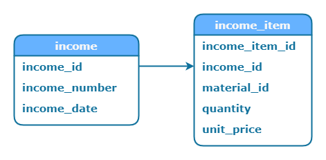

# Сохранение вложенных сущностей

В этой статье рассматриваются способы сохранения сущности, имеющей, помимо скалярных полей, табличные данные. Например, поступление, которое имеет дату и номер, а также список товаров:

<figure><figcaption></figcaption></figure>

Данные из карточки позиции поступления передаются на родительскую форму и добавляются в таблицу, откуда отправляются на сервер или передаются в карточку позиции для редактирования.

В базе данных поступление представлено двумя таблицами:

<figure><figcaption></figcaption></figure>

Есть два способа сохранения таких сущностей:

* последовательный вызов двух команд, которые отдельно сохраняют скалярные и табличные данные;
* создание на форме единого JSON-объекта, который отправляется на сервер одним запросом.

## Две команды SaveCommand

Первый способ заключается в использовании двух последовательных команд. Первая сохраняет скалярные данные и возвращает на форму идентификатор добавленной записи. Вторая сохраняет табличные данные, используя результат выполнения первой команды, в котором хранится идентификатор новой записи.

```xml
<Command Name="SaveSequentialCommand" Type="SequentialCommand" Assembly="Commands">
  <Commands>
    <Command Name="IncomeInsertSaveCommand" />       
    <Command Name="IncomeItemDatabaseTableSaveCommand" />
  </Commands>
</Command>
```


В примере рассматривается создание нового поступления и не описывается код для сохранения изменений в существующем поступлении.


Команда **IncomeInsertSaveCommand** вызывает [SetDataConnection](https://wfsys.gitbook.io/workflow-forms-syntax/workflow_forms/dataconnections/set_dc) с запросом:

```xml
<SqlQuery Name="IncomeInsertSqlQuery">
  <Text>
    INSERT INTO template.income(
      income_date,
      income_number
    )
    VALUES (
      {IncomeDate},
      {IncomeNumber}
    )
    RETURNING income_id;
  </Text>
</SqlQuery>
```

С необязательным предложением `RETURNING` команда `INSERT` возвращает значение колонки **income\_id** для добавленной записи. Это значение вернется на форму и будет храниться в результате команды **IncomeInsertSaveCommand**.

Как вариант, вместо предложения  `RETURNING` можно использовать функцию `currval` для получения текущего значения последовательности. Тогда запрос на сохранение скалярных данных будет иметь вид:

```xml
<SqlQuery Name="IncomeInsertSqlQuery">
  <Text>
    INSERT INTO template.income(
      income_date,
      income_number
    )
    VALUES (
      {IncomeDate},
      {IncomeNumber}
    );
    
    SELECT currval('template.income_id_seq'::regclass);
  </Text>
</SqlQuery>
```


Подробнее о функциях для работы с последовательностями в рамках одной транзакции можно почитать в статье [Функции nextval и currval](../sql/function_nextval_currval.md).


После того, как форма получила результат выполнения команды IncomeInsertSaveCommand, его можно использовать на форме, обращаясь к команде по имени.

Например, результат команды можно сохранить в параметр формы, вызвав команду [ValueSetCommand](https://wfsys.gitbook.io/workflow-forms-syntax/workflow_forms/commands/value_set_command) после вызова команды IncomeInsertSaveCommand:

```xml
<Command Name="IncomeIdValueSetCommand" Type="ValueSetCommand" Assembly="Commands">
  <Parameter Name="IncomeId">
    <Command Name="IncomeInsertSaveCommand" />
  </Parameter>
</Command>
```

Или сразу использовать в [DatabaseTableSetDataConnection](https://wfsys.gitbook.io/workflow-forms-syntax/workflow_forms/dataconnections/database_table_set_dc) для сохранения табличных данных, который вызывается во второй команде **IncomeItemDatabaseTableSaveCommand**:

```xml
<DataConnection Name="IncomeItemDatabaseTableSetDataConnection" Type="DatabaseTableSetDataConnection" Assembly="ComplexDataConnections">
  <Workflow Name="Template" />
  <DatabaseTable Name="IncomeItemDatabaseTable" />
  <Parameters>
    <Parameter NativeName="IncomeId">
      <Command Name="IncomeInsertSaveCommand" />
    </Parameter>
    <Parameter NativeName="IncomeItemId">
      <Column Name="IncomeItemId" />
    </Parameter>
    <Parameter NativeName="MaterialId">
      <Column Name="MaterialId" />
    </Parameter>
    <Parameter NativeName="Quantity">
      <Column Name="Quantity" />
    </Parameter>
    <Parameter NativeName="UnitPrice">
      <Column Name="UnitPrice" />
    </Parameter>
  </Parameters>
  <SqlQueries>
    <SqlQuery Name="IncomeItemInsertSqlQuery" Type="Insert" />
    <SqlQuery Name="IncomeItemUpdateSqlQuery" Type="Update" />
    <SqlQuery Name="IncomeItemDeleteSqlQuery" Type="Delete" />
  </SqlQueries>
</DataConnection>
```

В параметре **IncomeId** _обращаемся к результату_ выполнения команды, а _не вызываем_ ее повторно.


Команда [SaveCommand](https://wfsys.gitbook.io/workflow-forms-syntax/workflow_forms/commands/save_command) возвращает результат первого SqlQuery типа Insert первого [SetDataConnection](https://wfsys.gitbook.io/workflow-forms-syntax/workflow_forms/dataconnections/set_dc). Если SqlQuery типа Insert не указан в SetDataConnection, то будет возвращаться результат первого SqlQuery типа Update, если такой описан в сохраняющем соединении с данными. Иначе будет возвращаться результат первого SqlQuery типа Delete.


Недостаток такого варианта в том, что если команда сохранения табличных данных упадет с ошибкой, то изменения, внесенные в базу данных первой командой, все равно сохранятся. Таким образом, нарушится целостность данных.

## JSON-объект

Второй способ заключается в создании на форме JSON-объекта и передаче его одним запросом на сервер.

Первое, что нужно сделать - создать объект [Variable](https://wfsys.gitbook.io/workflow-forms-syntax/workflow_forms/objects/variable), в котором описать [структуру Dictionary](https://wfsys.gitbook.io/workflow-forms-syntax/workflow_forms/values/structure#dictionary), которая позже сериализуется в JSON-объект:

```xml
<MyObject Name="IncomeDictionaryVariable" Type="Variable" Assembly="SimpleControls" ChangeForm="False">
  <Value>
    <Structure Type="Dictionary" Refresh="False">
      <Key Name="common">
        <Structure Type="Dictionary" Refresh="False">
          <Key Name="income_id">
            <DataTypeConvert Type="IntegerDataType">
              <Parameter Name="IncomeId" Refresh="False" />
            </DataTypeConvert>
          </Key>
          <Key Name="income_date">
            <Object Name="IncomeDateDateTimePicker" Refresh="False" />
          </Key>
          <Key Name="income_number">
            <Object Name="IncomeNumberTextBox" Refresh="False" />
          </Key>
        </Structure>
      </Key>
      <Key Name="income_item_list">
        <Array>
          <Source>
            <Object Name="IncomeItemDatabaseTable" Refresh="False">
              <Property Name="DictionaryArrayData" />
            </Object>
          </Source>
          <Select>
            <Items>
              <Item Type="Field">IncomeItemId</Item>
              <Item Type="Field">MaterialId</Item>
              <Item Type="Field">Quantity</Item>
              <Item Type="Field">UnitPrice</Item>
            </Items>
          </Select>
          <ToDictionary>
            <Key Name="income_item_id" Index="0" />
            <Key Name="material_id" Index="1" />
            <Key Name="quantity" Index="2" />
            <Key Name="unit_price" Index="3" />
          </ToDictionary>
        </Array>
      </Key>
    </Structure>
  </Value>
</MyObject>
```


Обратите внимание, что у тэга `<MyObject>` стоит атрибут `ChangeForm` со значением False, чтобы этот объект исключить из проверки свойства [FormChanged](https://wfsys.gitbook.io/workflow-forms-syntax/#get_form_changed) самой формы.


Для списка позиций в поступлении используется конструкция [`<Array>`](https://wfsys.gitbook.io/workflow-forms-syntax/workflow_forms/values/array) с преобразованием массива строк из таблицы [DatabaseTable](https://wfsys.gitbook.io/workflow-forms-syntax/workflow_forms/objects/databasetable) в массив словарей.

У тэгов `<Object>` и `<Parameter>` используется атрибут `Refresh`, который определяет, будет ли обновляться значение у тэгов `<Key>` и `<Array>`, если изменится значение источника. Таким образом, значение объекта IncomeDictionaryVariable не будет обновляться каждый раз, когда изменяется какой-либо источник. Для ручного обновления IncomeDictionaryVariable нужно использовать команду [ValueSetCommand](https://wfsys.gitbook.io/workflow-forms-syntax/workflow_forms/commands/value_set_command) для обращения к set-проперти [Refresh](https://wfsys.gitbook.io/workflow-forms-syntax/workflow_forms/objects/variable#refresh) у объекта Variable:

```xml
<Command Name="IncomeDictionaryVariableRefreshValueSetCommand" Type="ValueSetCommand" Assembly="Commands">
  <Object Name="IncomeDictionaryVariable">
    <Property Name="Refresh" />
  </Object>
</Command>
```

Для преобразования словаря к JSON-объекту используется команда [SerializeToJsonCommand](https://wfsys.gitbook.io/workflow-forms-syntax/workflow_forms/commands/serialize_to_json_command):

```xml
<Command Name="IncomeDictionaryVariableSerializeToJsonCommand" Type="SerializeToJsonCommand" Assembly="Commands">
  <Variable>
    <Object Name="IncomeDictionaryVariable" />
  </Variable>
</Command>
```


Команда SerializeToJsonCommand при формировании JSON-объекта преобразует все даты со временем к UTC относительно временной зоны из пользовательских настроек.


Для передачи JSON-объекта на сервер используется команда IncomeSaveCommand типа SaveCommand, которая вызывает сохраняющее соединение:

```xml
<DataConnection Name="IncomeSaveSetDataConnection" Type="SetDataConnection" Assembly="DataConnections">
  <Workflow Name="Template" />
  <Parameters>
    <Parameter NativeName="Model">
      <Value>
        <Command Name="IncomeDictionarySerializeToJsonCommand" />
      </Value>
    </Parameter>
  </Parameters>
  <SqlQueries>
    <SqlQuery Name="IncomeSaveSqlQuery" Type="Update" />
  </SqlQueries>
</DataConnection>
```

В единственный параметр Model передается результат команды сериализации словаря.

Сам запрос IncomeSaveSqlQuery будет иметь вид:

```xml
<SqlQuery Name="IncomeSaveSqlQuery">
  <Text>
    SELECT template.income_save({Model}::json);
  </Text>
</SqlQuery>
```

<details>

<summary>template.income_save(json)</summary>

Шаблонный код функции, в котором показывается, как с помощью SQL разбирать скалярные поля и массивы в JSON-строке.

```sql
CREATE OR REPLACE FUNCTION template.income_save(in_model json)
  RETURNS bigint AS
$BODY$
DECLARE
  _income_id bigint = in_model -> 'common' ->> 'income_id';
  _income_date timestamp = (in_model -> 'common' ->> 'income_date')::timestamp;
  _income_number character varying = in_model -> 'common' ->> 'income_number';
  _record record;
BEGIN

  IF (_income_id IS NULL)
  THEN
    -- INSERT INTO template.income ... RETURNING income_id INTO _income_id;
  ELSE
    -- UPDATE template.income
  END IF;

-- Сохранение позиций поступления
  FOR _record IN (
    SELECT *
    FROM
      json_to_recordset(in_model -> 'income_item_list') AS x(
        income_item_id bigint,
        material_id bigint,
        quantity numeric,
        unit_price numeric
      )
  ) LOOP
    IF (_record.income_item_id IS NULL) THEN
      -- INSERT INTO template.income_item
    ELSE
      -- UPDATE template.income_item
    END IF;

    -- DELETE FROM template.income_item
  END LOOP;

-- Сохранение позиций поступления

  RETURN _income_id;
END;
$BODY$
  LANGUAGE plpgsql;
```

Функция возвращает идентификатор поступления, который будет передаваться на форму в результат выполнения команды.

</details>

Результат запроса будет храниться в результате команды IncomeSaveCommand, который можно получить по имени команды и сохранить в параметр формы, чтобы использовать его дальше на форме:

```xml
<Command Name="IncomeIdValueSetCommand" Type="ValueSetCommand" Assembly="Commands">
  <Parameter Name="IncomeId">
    <Command Name="IncomeSaveCommand" />
  </Parameter>
</Command>
```

Итоговая команда SaveSequentialCommand будет иметь вид:

```xml
<Command Name="SaveSequentialCommand" Type="SequentialCommand" Assembly="Commands">
  <Commands>
    <Command Name="IncomeDictionaryVariableRefreshCommand" />
    <Command Name="IncomeDictionarySerializeToJsonCommand" />
    <Command Name="IncomeSaveCommand" />
    <Command Name="IncomeIdValueSetCommand" />
  </Commands>
</Command>
```

Сначала обновляем переменную IncomeDictionaryVariable, а затем сериализуем ее в JSON-объект и передаем на сервер.

Преимущество этого варианта в том, что все данные отправляются на сервер одним запросом и обрабатываются в одной транзакции, что гарантирует целостность данных.
